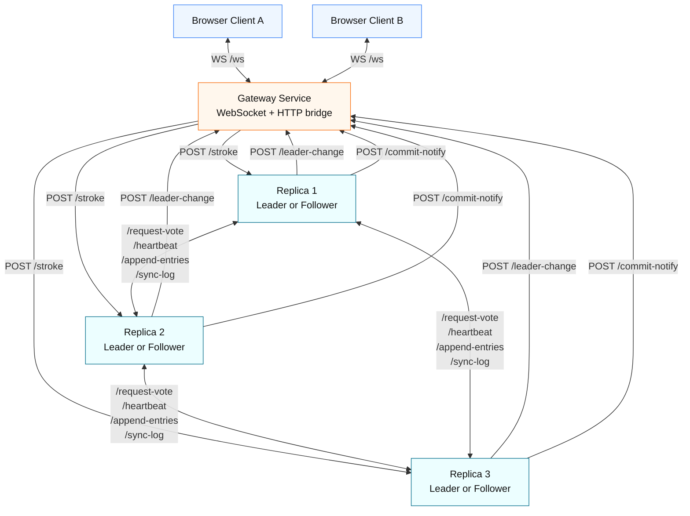

# Distributed Real-Time Drawing Board (Mini-RAFT)

A distributed collaborative drawing board built with:

- TypeScript + Node.js
- Express (internal RPC-style HTTP endpoints)
- WebSocket (gateway to browser clients)
- Docker Compose (multi-service local deployment)

The system uses a simplified Mini-RAFT implementation to elect a leader and replicate drawing strokes across replica nodes.

This version also includes an observability layer:
- Structured event logs across gateway/replicas
- Replica `GET /status` endpoint with live state snapshot + recent events
- Dashboard service with node cards and live event feed

---

## 1) What this project does

Users draw on a shared canvas in the browser. Each stroke is:

1. sent to the Gateway over WebSocket,
2. forwarded to the current RAFT leader,
3. replicated to follower replicas,
4. committed after majority acknowledgement,
5. broadcast back to all connected clients.

Result: all users converge to the same committed canvas history, while the replica cluster can tolerate a single-node failure.

---

## 2) High-level architecture



---

## 3) Components

### Frontend

- Location: `dashboard/public/board.html`
- Provides a canvas and pointer-based drawing.
- Opens a WebSocket connection to the gateway (`/ws` on port `3000`).
- Displays:
  - committed strokes (cluster-approved),
  - pending strokes (optimistic local overlay).

### Gateway

- Location: `services/gateway/src/index.ts`
- Responsibilities:
  - maintain WebSocket client connections,
  - forward incoming strokes to current leader via HTTP,
  - multi-tier failover on forward failure: leaderHint → parallel probe (skipping dead node) → 500ms requeue,
  - inline commit broadcast: when the leader responds with `committed: true`, the gateway broadcasts immediately to all WebSocket clients,
  - fallback commit handling via `POST /commit-notify` (with dedup),
  - in-flight stroke dedup via `pendingStrokes` tracking,
  - track leader changes via `POST /leader-change`.

### Replicas (Mini-RAFT)

- Location: `services/replica/src/raftNode.ts`
- Each replica can be in one of:
  - follower,
  - candidate,
  - leader.
- Responsibilities:
  - leader election (`/request-vote`) with `Promise.allSettled` and early quorum resolution,
  - per-peer heartbeat dispatch (`/heartbeat`) with `leaderCommit` synchronization and in-flight tracking,
  - log replication (`/append-entries`) with early quorum resolution,
  - catch-up sync (`/sync-log`) with awaited `syncFollower`,
  - `leaderHint` responses from non-leader `/stroke` handlers (409 with hint),
  - async commit notification to gateway (fire-and-forget),
  - observability state via `GET /status`.

### Dashboard

- Location: `dashboard/src/index.ts` + `dashboard/public/index.html`
- Responsibilities:
  - serve the drawing board frontend (`board.html`),
  - serve the dashboard UI (`index.html`),
  - poll replicas for `GET /status` via `GET /api/status`,
  - stream deduplicated recent events via `GET /api/events` (SSE),
  - render leader/follower/candidate/unreachable states and lag indicators.

### Shared contracts

- Location: `packages/shared/src/index.ts`
- Contains all common TypeScript interfaces for RPC and WebSocket payloads.

### Shared logger

- Location: `packages/shared/src/logger.ts`
- Provides structured logger with stdout format:
  - `[replicaId] [ISO timestamp] [EVENT_TYPE] message`
- Maintains circular in-memory buffer (last 100 events) for dashboard/status consumption.

---

## 4) Repository structure

```text
.
├── packages/
│   └── shared/
│       └── src/
│           ├── index.ts
│           └── logger.ts
├── dashboard/
│   ├── src/
│   │   └── index.ts
│   └── public/
│       ├── index.html
│       └── board.html
├── services/
│   ├── gateway/
│   │   └── src/index.ts
│   └── replica/
│       └── src/
│           ├── config.ts
│           ├── index.ts
│           └── raftNode.ts
├── docker-compose.yml
└── package.json
```

---

## 5) Step-by-step: run the project

## Prerequisites

- Docker Desktop (or Docker Engine + Compose plugin)
- Node.js 18+ and npm (for local workspace commands)

## Setup

1. Install workspace dependencies:

   ```bash
   npm install
   ```

2. Start all services:

   ```bash
   docker compose up --build
   ```

3. Open the drawing app:

  - Frontend UI: http://localhost:3001/board.html
  - Dashboard UI: http://localhost:3001

4. Open the service health endpoints (optional):

  - Gateway health: http://localhost:3000/health
  - Gateway state: http://localhost:3000/state
  - Replica1 health: http://localhost:4001/health
  - Replica2 health: http://localhost:4002/health
  - Replica3 health: http://localhost:4003/health
  - Replica1 status: http://localhost:4001/status
  - Replica2 status: http://localhost:4002/status
  - Replica3 status: http://localhost:4003/status
  - Dashboard aggregated status: http://localhost:3001/api/status

5. Validate replication quickly:

   - Open two browser tabs at `http://localhost:3001/board.html`.
   - Draw in one tab.
   - Confirm committed strokes appear in both tabs.

## Stop

```bash
docker compose down
```

---

## 6) What is happening internally (runtime flow)

### A) Client draw path

1. Client sends `{ type: "stroke", stroke, localId }` to gateway over WebSocket.
2. Gateway forwards stroke to current leader via `POST /stroke`.
3. Leader appends stroke as a new log entry.
4. Leader sends `POST /append-entries` to followers (resolves on quorum, does not block on dead peers).
5. After majority success, leader marks entry committed.
6. Leader responds to gateway with `{ committed: true, logIndex }`.
7. Gateway immediately broadcasts committed event to all WebSocket clients.
8. Leader also fires `POST /commit-notify` to gateway in background (dedup-safe fallback).
9. Leader fires an immediate heartbeat to push `leaderCommit` to followers.

### B) Election and failover path

1. Followers expect periodic heartbeats from leader.
2. If heartbeat times out, a follower becomes candidate.
3. Candidate increments term, votes for self, requests votes.
4. On majority votes, candidate becomes leader.
5. New leader clears election timer, starts per-peer heartbeat dispatch.
6. New leader notifies gateway via `POST /leader-change`.
7. Gateway routes new writes to the updated leader.
8. If gateway's cached leader is stale, stroke forwarding falls back through: leaderHint → parallel probe (skipping dead node) → 500ms requeue.

### C) Catch-up path

1. A lagging follower rejects append due to log mismatch/short log.
2. Leader gets follower log length from response.
3. Leader calls `POST /sync-log` with missing suffix entries.
4. Follower updates log and commit index, then rejoins normal flow.

---

## 7) Network ports and endpoints

## Ports

- Gateway: `3000`
- Dashboard & Frontend: `3001`
- Replica1: `4001`
- Replica2: `4002`
- Replica3: `4003`

## Gateway endpoints

- `GET /health`
- `GET /state`
- `POST /leader-change`
- `POST /commit-notify`
- `WS /ws`

## Replica endpoints

- `GET /health`
- `GET /status`
- `GET /debug/log`
- `POST /stroke`
- `POST /request-vote`
- `POST /heartbeat`
- `POST /append-entries`
- `POST /sync-log`

## Dashboard endpoints

- `GET /` (dashboard UI)
- `GET /api/status` (aggregated replica statuses)
- `GET /api/events` (SSE event stream)

---

## 8) Common troubleshooting

- Frontend cannot connect:
  - ensure gateway is running on port 3000,
  - check browser console for WebSocket errors.

- Strokes not committing:
  - verify at least 2 replicas are healthy,
  - inspect `GET /health` on each replica for state/term info,
  - check gateway `GET /state` for current leader id.

- Services fail to start:
  - run `docker compose down` then `docker compose up --build` again,
  - ensure no local process is already using ports 3000/3001/4001/4002/4003.

---

## 9) Testing failover

1. Start the cluster in detached mode:
   ```bash
   docker compose up -d --build
   ```
2. Open the frontend at `http://localhost:3001/board.html` and draw a few strokes to confirm the system is working.
3. Kill a specific replica (e.g., the current leader):
   ```bash
   docker stop cc_mini-raft_project-replica1-1
   ```
4. Draw more strokes — they should appear normally on the canvas. The remaining two replicas will elect a new leader and the gateway will discover it automatically.
5. Restart the dead replica:
   ```bash
   docker start cc_mini-raft_project-replica1-1
   ```
6. The restarted replica will rejoin as a follower and sync its log via the catch-up mechanism.

> **Note:** Always use `docker compose up -d` (detached mode) for failover testing. Running attached (`docker compose up`) will cause Docker Compose to shut down all containers when one is stopped.

---

## 10) Development notes

- This is a Mini-RAFT educational implementation, intentionally simplified.
- State is primarily in-memory; behavior across full restarts depends on current running cluster state.
- Core RAFT timing is configured at heartbeat `150ms`, election timeout `500–800ms`.
- Heartbeat log emission is intentionally throttled (default `HEARTBEAT_LOG_INTERVAL_MS=4000`) to keep logs event-focused while preserving protocol timing.
- For a production-grade version, expected additions include durable storage and centralized observability/metrics.
