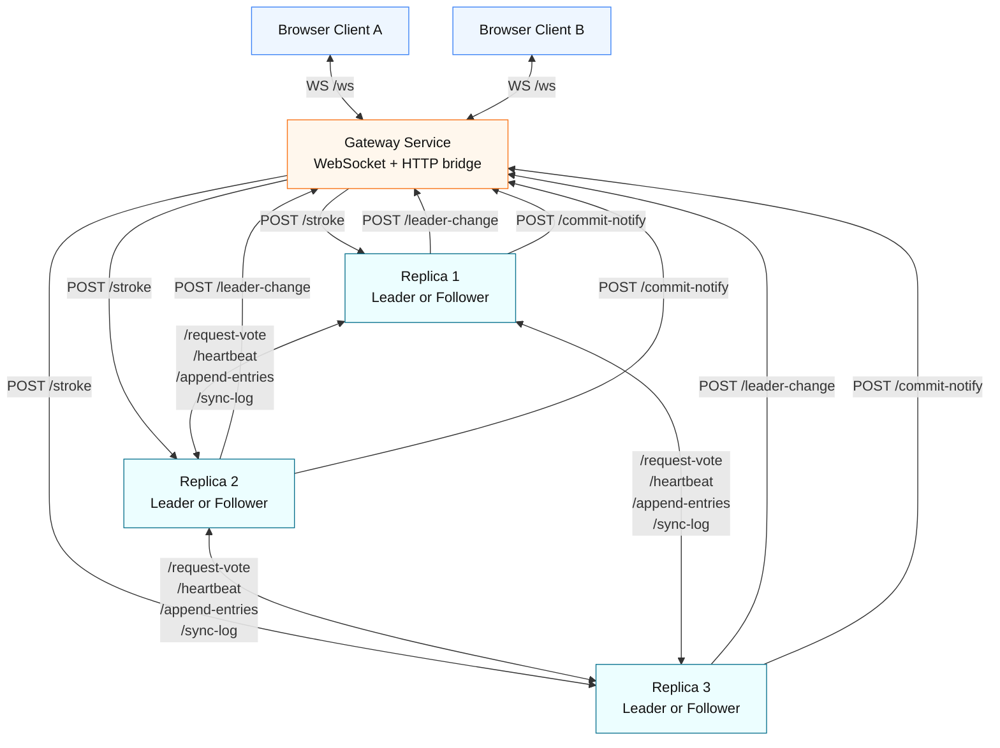

# Distributed Real-Time Drawing Board (Mini-RAFT)

A distributed collaborative drawing board built with:

- TypeScript + Node.js
- Express (internal RPC-style HTTP endpoints)
- WebSocket (gateway to browser clients)
- Docker Compose (multi-service local deployment)

The system uses a simplified Mini-RAFT implementation to elect a leader and replicate drawing strokes across replica nodes.

This version also includes an observability layer:
- Structured event logs across gateway/replicas
- Replica `GET /status` endpoint with live state snapshot + recent events
- Dashboard service with node cards and live event feed

---

## 1) What this project does

Users draw on a shared canvas in the browser. Each stroke is:

1. sent to the Gateway over WebSocket,
2. forwarded to the current RAFT leader,
3. replicated to follower replicas,
4. committed after majority acknowledgement,
5. broadcast back to all connected clients.

Result: all users converge to the same committed canvas history, while the replica cluster can tolerate a single-node failure.

---

## 2) High-level architecture


```mermaid
flowchart TD
    C1[Browser Client A]:::client
    C2[Browser Client B]:::client
    G[Gateway Service<br/>WebSocket + HTTP bridge]:::gateway

    R1[Replica 1<br/>Leader or Follower]:::replica
    R2[Replica 2<br/>Leader or Follower]:::replica
    R3[Replica 3<br/>Leader or Follower]:::replica

    C1 <-->|WS /ws| G
    C2 <-->|WS /ws| G

    G -->|POST /stroke| R1
    G -->|POST /stroke| R2
    G -->|POST /stroke| R3

    R1 <-->|/request-vote<br/>/heartbeat<br/>/append-entries<br/>/sync-log| R2
    R2 <-->|/request-vote<br/>/heartbeat<br/>/append-entries<br/>/sync-log| R3
    R1 <-->|/request-vote<br/>/heartbeat<br/>/append-entries<br/>/sync-log| R3

    R1 -->|POST /leader-change| G
    R2 -->|POST /leader-change| G
    R3 -->|POST /leader-change| G

    R1 -->|POST /commit-notify| G
    R2 -->|POST /commit-notify| G
    R3 -->|POST /commit-notify| G

    classDef client fill:#eef6ff,stroke:#3b82f6,color:#111;
    classDef gateway fill:#fff7ed,stroke:#f97316,color:#111;
    classDef replica fill:#ecfeff,stroke:#0e7490,color:#111;
```

---

## 3) Components

### Frontend

- Location: React + Vite source under `dashboard/src/board/`; production build writes `dashboard/dist/client/board.html` and hashed assets under `dashboard/dist/client/assets/`.
- Local UI development: `npm run dev:client -w @mini-raft/dashboard` (Vite on port `5174`, WebSocket still targets the gateway on port `3000`). Run `npm run build -w @mini-raft/dashboard` before relying on Express alone to serve the latest board.
- Toolbar icon paths are listed in `dashboard/src/board/components/Toolbar.tsx` (resolved as `/icons/*` from `dashboard/public/icons/`).
- Provides a canvas and pointer-based drawing.
- Opens a WebSocket connection to the gateway (`/ws` on port `3000`).
- Displays:
  - committed strokes (cluster-approved),
  - pending strokes (optimistic local overlay).

### Gateway

- Location: `services/gateway/src/index.ts`
- Responsibilities:
  - maintain WebSocket client connections,
  - forward incoming strokes to current leader via HTTP,
  - multi-tier failover on forward failure: leaderHint → parallel probe (skipping dead node) → 500ms requeue,
  - inline commit broadcast: when the leader responds with `committed: true`, the gateway broadcasts immediately to all WebSocket clients,
  - fallback commit handling via `POST /commit-notify` (with dedup),
  - in-flight stroke dedup via `pendingStrokes` tracking,
  - track leader changes via `POST /leader-change`.

### Replicas (Mini-RAFT)

- Location: `services/replica1/src/raftNode.ts`, `services/replica2/src/raftNode.ts`, `services/replica3/src/raftNode.ts`
- Each replica can be in one of:
  - follower,
  - candidate,
  - leader.
- Responsibilities:
  - leader election (`/request-vote`) with `Promise.allSettled` and early quorum resolution,
  - per-peer heartbeat dispatch (`/heartbeat`) with `leaderCommit` synchronization and in-flight tracking,
  - log replication (`/append-entries`) with early quorum resolution,
  - catch-up sync (`/sync-log`) with awaited `syncFollower`,
  - `leaderHint` responses from non-leader `/stroke` handlers (409 with hint),
  - async commit notification to gateway (fire-and-forget),
  - observability state via `GET /status`.

### Dashboard

- Location: `dashboard/src/index.ts` + `dashboard/public/index.html`
- Responsibilities:
  - serve the drawing board frontend (`board.html`),
  - serve the dashboard UI (`index.html`),
  - poll replicas for `GET /status` via `GET /api/status`,
  - stream deduplicated recent events via `GET /api/events` (SSE),
  - render leader/follower/candidate/unreachable states and lag indicators.

### Shared contracts

- Location: `packages/shared/src/index.ts`
- Contains all common TypeScript interfaces for RPC and WebSocket payloads.

### Shared logger

- Location: `packages/shared/src/logger.ts`
- Provides structured logger with stdout format:
  - `[replicaId] [ISO timestamp] [EVENT_TYPE] message`
- Maintains circular in-memory buffer (last 100 events) for dashboard/status consumption.

---

## 4) Repository structure

```text
.
├── packages/
│   └── shared/
│       └── src/
│           ├── index.ts
│           └── logger.ts
├── dashboard/
│   ├── src/
│   │   ├── index.ts
│   │   └── board/
│   │       ├── App.tsx
│   │       ├── main.tsx
│   │       ├── board.css
│   │       ├── constants.ts
│   │       ├── components/
│   │       ├── types.ts
│   │       └── useBoardEngine.ts
│   ├── board.html              ← Vite entry (dev + build input)
│   ├── vite.config.ts
│   ├── tsconfig.board.json
│   ├── dist/client/             ← Vite build output (gitignored)
│   │   ├── board.html
│   │   └── assets/
│   └── public/
│       ├── index.html
│       └── icons/
├── services/
│   ├── gateway/
│   │   └── src/index.ts
│   ├── replica1/
│   │   └── src/
│   │       ├── config.ts
│   │       ├── index.ts
│   │       └── raftNode.ts
│   ├── replica2/
│   │   └── src/
│   │       ├── config.ts
│   │       ├── index.ts
│   │       └── raftNode.ts
│   └── replica3/
│       └── src/
│           ├── config.ts
│           ├── index.ts
│           └── raftNode.ts
├── docker-compose.yml
└── package.json
```

---

## 5) Step-by-step: run the project

## Prerequisites

- Docker Desktop (or Docker Engine + Compose plugin)
- Node.js 18+ and npm (for local workspace commands)

## Setup

1. Create your environment file:

  ```bash
  cp .env.example .env
  ```

  On Windows PowerShell:

  ```powershell
  Copy-Item .env.example .env
  ```

  The defaults are production-safe for this topology and preserve the current behavior.

  `docker-compose.yml` now uses environment-variable substitution with fallback defaults, so you can tune ports, peer maps, and RAFT timing via `.env` without editing source files.

2. Install workspace dependencies:

   ```bash
   npm install
   ```

3. Start all services:

   ```bash
   docker compose up --build
   ```

  After startup, gateway/replicas/dashboard run in watch mode with `nodemon`, so TypeScript changes under `services/*/src`, `dashboard/src`, and `packages/shared/src` trigger automatic restarts.

4. Open the drawing app:

  - Frontend UI: http://localhost:3001/board.html
  - Dashboard UI: http://localhost:3001

5. Open the service health endpoints (optional):

  - Gateway health: http://localhost:3000/health
  - Gateway state: http://localhost:3000/state
  - Replica1 health: http://localhost:4001/health
  - Replica2 health: http://localhost:4002/health
  - Replica3 health: http://localhost:4003/health
  - Replica1 status: http://localhost:4001/status
  - Replica2 status: http://localhost:4002/status
  - Replica3 status: http://localhost:4003/status
  - Dashboard aggregated status: http://localhost:3001/api/status

6. Validate replication quickly:

   - Open two browser tabs at `http://localhost:3001/board.html`.
   - Draw in one tab.
   - Confirm committed strokes appear in both tabs.

## Stop

```bash
docker compose down
```

## Deployment configuration note

- `.env.example` is the deployment template for this project.
- `.env` is ignored by git and should be environment-specific.
- If `.env` is missing, Compose falls back to the same defaults used by the previous hardcoded implementation.

---

## 6) What is happening internally (runtime flow)

### A) Client draw path

1. Client sends `{ type: "stroke", stroke, localId }` to gateway over WebSocket.
2. Gateway forwards stroke to current leader via `POST /stroke`.
3. Leader appends stroke as a new log entry.
4. Leader sends `POST /append-entries` to followers (resolves on quorum, does not block on dead peers).
5. After majority success, leader marks entry committed.
6. Leader responds to gateway with `{ committed: true, logIndex }`.
7. Gateway immediately broadcasts committed event to all WebSocket clients.
8. Leader also fires `POST /commit-notify` to gateway in background (dedup-safe fallback).
9. Leader fires an immediate heartbeat to push `leaderCommit` to followers.

### B) Election and failover path

1. Followers expect periodic heartbeats from leader.
2. If heartbeat times out, a follower becomes candidate.
3. Candidate increments term, votes for self, requests votes.
4. On majority votes, candidate becomes leader.
5. New leader clears election timer, starts per-peer heartbeat dispatch.
6. New leader notifies gateway via `POST /leader-change`.
7. Gateway routes new writes to the updated leader.
8. If gateway's cached leader is stale, stroke forwarding falls back through: leaderHint → parallel probe (skipping dead node) → 500ms requeue.

### C) Catch-up path

1. A lagging follower rejects append due to log mismatch/short log.
2. Leader gets follower log length from response.
3. Leader calls `POST /sync-log` with missing suffix entries.
4. Follower updates log and commit index, then rejoins normal flow.

---

## 7) Network ports and endpoints

## Ports

- Gateway: `3000`
- Dashboard & Frontend: `3001`
- Replica1: `4001`
- Replica2: `4002`
- Replica3: `4003`

## Gateway endpoints

- `GET /health`
- `GET /state`
- `POST /leader-change`
- `POST /commit-notify`
- `WS /ws`

## Replica endpoints

- `GET /health`
- `GET /status`
- `GET /debug/log`
- `POST /stroke`
- `POST /request-vote`
- `POST /heartbeat`
- `POST /append-entries`
- `POST /sync-log`

## Dashboard endpoints

- `GET /` (dashboard UI)
- `GET /api/status` (aggregated replica statuses)
- `GET /api/events` (SSE event stream)

---

## 8) Common troubleshooting

- Frontend cannot connect:
  - ensure gateway is running on port 3000,
  - check browser console for WebSocket errors.

- Strokes not committing:
  - verify at least 2 replicas are healthy,
  - inspect `GET /health` on each replica for state/term info,
  - check gateway `GET /state` for current leader id.

- Services fail to start:
  - run `docker compose down` then `docker compose up --build` again,
  - ensure no local process is already using ports 3000/3001/4001/4002/4003.

---

## 9) Testing failover

1. Start the cluster in detached mode:
   ```bash
   docker compose up -d --build
   ```
2. Open the frontend at `http://localhost:3001/board.html` and draw a few strokes to confirm the system is working.
3. Kill a specific replica (e.g., the current leader):
   ```bash
   docker stop cc_mini-raft_project-replica1-1
   ```
4. Draw more strokes — they should appear normally on the canvas. The remaining two replicas will elect a new leader, and the gateway will discover it automatically.
5. Restart the dead replica:
   ```bash
   docker start cc_mini-raft_project-replica1-1
   ```
6. The restarted replica will rejoin as a follower and sync its log via the catch-up mechanism.

---

## 10) Hot reload (Nodemon)

Hot reload is enabled for gateway, replicas, and dashboard in Docker Compose.

### What this adds

- Faster iteration: save code and service restarts automatically.
- No manual container restart for normal backend/dashboard TypeScript edits.
- Shared package edits (`packages/shared/src`) also trigger restarts in dependent services.

### What you can do now

- Edit RAFT logic in any one replica (`services/replica1/src/raftNode.ts`, `services/replica2/src/raftNode.ts`, or `services/replica3/src/raftNode.ts`) and observe only that replica restarting.
- Edit gateway routing/failover logic in `services/gateway/src/index.ts` and retest without rebuilding.
- Edit dashboard API/server code in `dashboard/src/index.ts` and refresh the browser.
- Edit shared contracts/logger in `packages/shared/src/*` and watch all dependent services restart with new shared code.

### Quick live demo (for presentation)

1. Start the stack:
  ```bash
  docker compose up --build
  ```
2. Keep logs visible in the same terminal.
3. Open `http://localhost:3001/board.html` and `http://localhost:3001`.
4. In `services/replica2/src/index.ts`, change a startup log message string and save.
5. Show terminal output: nodemon detects file change and restarts the replica automatically.
6. Confirm only `replica2` restarts, while `replica1` and `replica3` remain up.
7. Draw a stroke again to prove the system stays live after auto-restart.

## 11) Development notes

- This is a Mini-RAFT educational implementation, intentionally simplified.
- State is primarily in-memory; behavior across full restarts depends on current running cluster state.
- Core RAFT timing is configured at heartbeat `150ms`, election timeout `500–800ms`.
- Heartbeat log emission is intentionally throttled (default `HEARTBEAT_LOG_INTERVAL_MS=4000`) to keep logs event-focused while preserving protocol timing.
- For a production-grade version, expected additions include durable storage and centralized observability/metrics.

---

## 12) Future work

### 12.1 Stronger consistency guarantees

Current state:
- Best-effort writes with occasional drops.

Planned improvements:
- Implement strict commit acknowledgment.
- Add retries and idempotency using stroke IDs.

Expected outcome:
- Moves the system from "usually consistent" to "provably consistent."

### 12.2 Full Raft implementation

Current state:
- Mini-Raft (simplified).

Missing pieces:
- `nextIndex` / `matchIndex` tracking.
- Log compaction.
- Snapshotting.
- Proper leader lease behavior.

Expected outcome:
- Evolves the implementation from demo Raft to a closer to production-grade Raft.

### 12.3 Persistent storage

Current state:
- All state is held in memory (RAM).

Planned improvements:
- Store logs on disk (SQLite/files/LevelDB).
- Recover node state after restart.

Expected outcome:
- Node restarts do not cause data loss.

### 12.4 Improved gateway reliability

Current state:
- Leader discovery works but can lag.
- Writes may fail during leader transitions.

Planned improvements:
- Smarter leader caching.
- Exponential backoff retries.
- Multi-node probing.

Expected outcome:
- Faster and more stable write routing.

### 12.5 Request prioritization and scheduling

Current state:
- Sync, heartbeats, and writes compete equally.

Planned improvements:
- Prioritize heartbeat/vote traffic as highest priority.
- Keep writes as high priority.
- Run sync traffic at lower priority.

Expected outcome:
- Reduces starvation and blocking behavior.

### 12.6 Advanced observability

Current state:
- Live dashboard is available.

Planned improvements:
- Add metrics for commit latency, election frequency, and replication lag.
- Add historical log views.
- Add failure visualization.

Expected outcome:
- Strengthens the project as both a teaching tool and a system monitor.

### 12.7 Authentication and access control

Current state:
- Open environment with no access controls.

Planned improvements:
- User authentication.
- Session-based drawing.
- Role-based access control.

Expected outcome:
- Prevents unauthorized usage and improves accountability.

### 12.8 Real deployment architecture

Current state:
- Single EC2/local cluster style deployment.

Planned improvements:
- Multi-region deployment.
- Container orchestration with Kubernetes.
- Auto-scaling replicas.

Expected outcome:
- Moves the system toward cloud-native operation.

### 12.9 Conflict-free replication (CRDT alternative)

Current state:
- Strong consistency through Raft.

Planned improvements:
- Explore CRDT-based drawing synchronization.

Expected outcome:
- Offers eventual consistency with no leader requirement.

### 12.10 Performance optimization

Planned improvements:
- Batch strokes.
- Add compression.
- Reduce network chatter.

Expected outcome:
- Improves latency and scalability.

### 12.11 Enhanced frontend features

Planned improvements:
- Layers.
- Collaborative cursors.
- User presence indicators.
- Version history/time travel.

### 12.12 Fault injection testing

Current state:
- Manual chaos testing (for example, `docker stop`).

Planned improvements:
- Simulate network delays.
- Simulate packet loss.
- Simulate node crashes.

Expected outcome:
- Establishes lightweight chaos engineering coverage.
